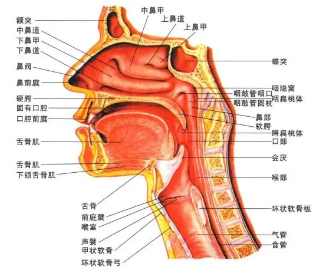

<!--more-->

### 声音基础知识

#### 发声器官

- 动力区
  - 肺部：通过肺部收缩产生气流
  - 腹部：通过横膈膜下移产生气流
- 声源区
  - 声带：通过声带的收缩和放松控制生门的开放程度
- 调音区
  - 胸腔:
  - 喉腔：
  - 咽腔：
  - 口腔：
  - 鼻腔：
    

#### 咬字器官

- 舌头
- 唇齿

#### 声音属性

- 响度
- 音调
- 音色

#### 三腔共鸣

- 胸腔共鸣
- 口腔共鸣
- 鼻腔共鸣

### 声音优化练习

#### 器官练习

- 目标：提高器官强度，加强器官控制

#### 咬字练习

- 目标：保证发音标准，确保咬字清晰

#### 发声练习

- 目标：掌握情感把控，掌控声音产生，灵活声音变化

```
参考链接：
1. https://mp.weixin.qq.com/s?__biz=MzI1NTYxNDYxMw==&mid=2247488443&idx=1&sn=a85be9c5b9dd222bd140d5341f988902&chksm=ea321841dd45915779b298c0d5379e5f3e38eccd7cec7256f03bfd1ab15c46a074cd9ee5178e&scene=27

```
