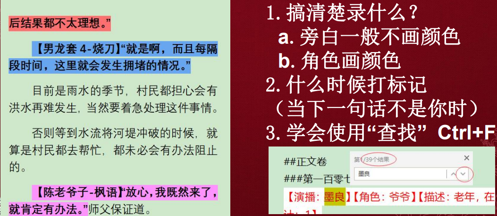
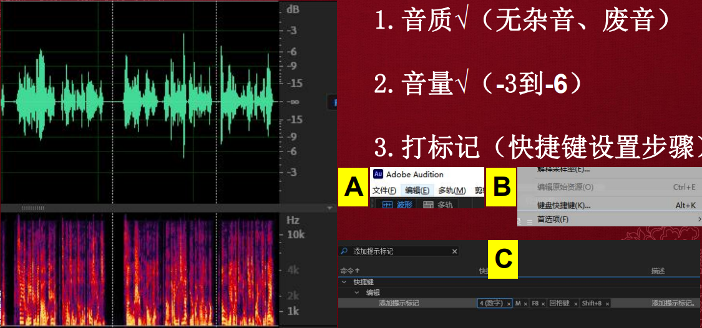
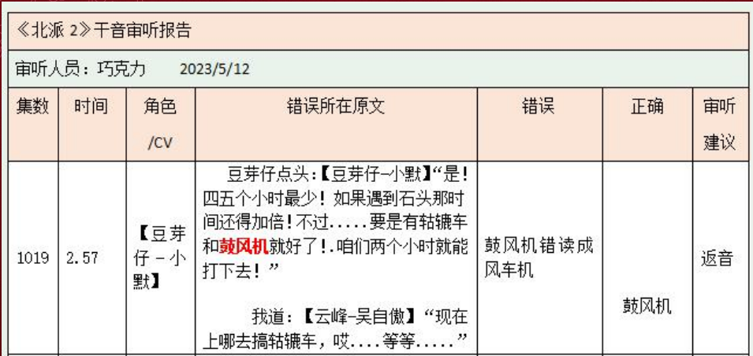

### 基础概念

- 有声书：有声书是一种个人或多人依据文稿并借着不同的声音表情和录音格式所录制的作品（把文字变成音频供听众欣赏）
- 受众：
  - 不方便阅读的人（主要）
  - 视觉受损或视力不好人士
  - 声音爱好者（声控）
- 优质有声书的标准
  1. 听着舒服（双向【说的人舒服，听的人舒服】）
  2. 戏感到位（画面+情绪）
  3. 个人特色（加分项）

### 有声书的制作

制作流程：

  1. 画本
    
    - 注意：
  2. 录制
    
    - 注意：
  3. 审反
    
    - 注意：
      1. 只需重新补录正确部分；返音要求与录制相同

### 有声书的分类

- 出版物
  
- 社科类
  
- 网络小说
  - 男频搞笑
    
  - 女频宫斗
    
  - 男频玄幻
    